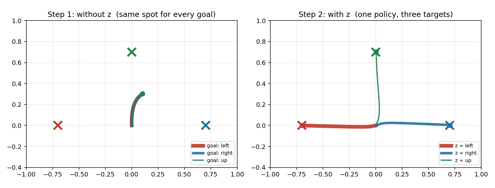

# 写経で学ぶ強化学習

ノートPC1台、GPU不要、MuJoCo不要で読み進められる強化学習の写経本2冊と、そのコード。
2冊とも同じ環境（`code/reach_env.py`）を題材にしています。

| # | 本 | 内容 | 所要 |
|---|---|---|---|
| 01 | [環境から入る強化学習](https://katsuyuki-nakamura.github.io/physical-ai-study/RL/docs/rl-from-env.html) | `reach_env.py` の各行を出発点に、観測・報酬・リターン・価値・終了条件を埋める | 全7章 |
| 02 | [写経で覚える目標ベクトル](https://katsuyuki-nakamura.github.io/physical-ai-study/RL/docs/goal-vector.html) | 1つの方策で3つの的を撃ち分ける。目標条件付け（goal-conditioned RL）の入口 | 40〜60分 |

**01 → 02 の順**を想定しています。01 で環境の書き方と用語（観測・報酬・価値）を固めてから、02 で実際に学習を回して「目標ベクトルを足すと解けるようになる」ところを見ます。動くものを先に見たい場合は 02 から読んでも構いません。

本文は GitHub Pages で公開しています → **<https://katsuyuki-nakamura.github.io/physical-ai-study/>**
実体は `docs/` 以下の HTML で、クローンすればローカルのブラウザでもそのまま開けます（ビルド不要）。



---

## セットアップ

```bash
python3 -m venv .venv && source .venv/bin/activate
pip install -r requirements.txt
```

## 実行

スクリプトは `reach_env.py` を隣から import するので、`code/` の中で実行します。

```bash
cd code

# 本01: 環境から入る強化学習（学習は回さないので数秒）
python ch1_loop.py         # ループを手で回す
python ch2_markov.py       # 観測が状況を区別できるか
python ch3_space.py        # 行動空間と観測空間
python ch4_reward.py       # 密な報酬と疎な報酬
python ch5_return.py       # リターンと割引率
python ch6_value.py        # 価値をモンテカルロで見積もる
python ch7_bootstrap.py    # terminated と truncated

# 本02: 目標ベクトル
python step1_plain.py      # z なしで学習して失敗を見る（学習 1〜3分）
python step2_goal.py       # z を足して学習（学習 1〜3分）
python step3_switch.py     # 重みを触らず z を差し替える
python plot.py             # 冒頭の図を書き出す
```

`ch6_value.py` は `step2_goal.py` が作った `ppo_goal.zip` があれば、学習済み方策の価値も並べて出します。無くても動きます。

---

## 構成

```
physical-ai-study/
├── index.html                    GitHub Pages の入口（2冊へのリンク）
└── RL/
    ├── docs/                     本文（単体で開けるHTML）
    │   ├── rl-from-env.html     『環境から入る強化学習』
    │   └── goal-vector.html     『写経で覚える目標ベクトル』
    ├── code/                     写経コードの正本。ここで実行する
    │   ├── reach_env.py          2冊が共有する環境
    │   ├── ch1_loop.py 〜 ch7_bootstrap.py  本01
    │   └── step1_plain.py 〜 plot.py 本02
    ├── copying/                  手で書き写す用の作業場所
    └── assets/
        └── trajectories.png
```

`docs/` の HTML はビルド成果物ではなく手書きのページです。編集するときはこのファイルを直接直します。

`copying/` は本文のコードを自分で打ち直すための場所です。`code/` の正本とは分けてあるので、写経が動かなくなっても元は壊れません。ただし `reach_env.py` を隣から import する都合上、実行するときは `code/` の中で走らせるか、`copying/` に `reach_env.py` を置いてください。

---

## 動作を確認した環境

- Python 3.11
- gymnasium 1.3.0
- stable-baselines3 2.9.0（torch 2.14, CPU）
- numpy 2.4
- matplotlib 3.10

本文に載せた出力はすべて実行して確認したものです。乱数は種を固定してあるので、同じ数字が出るはずです。
